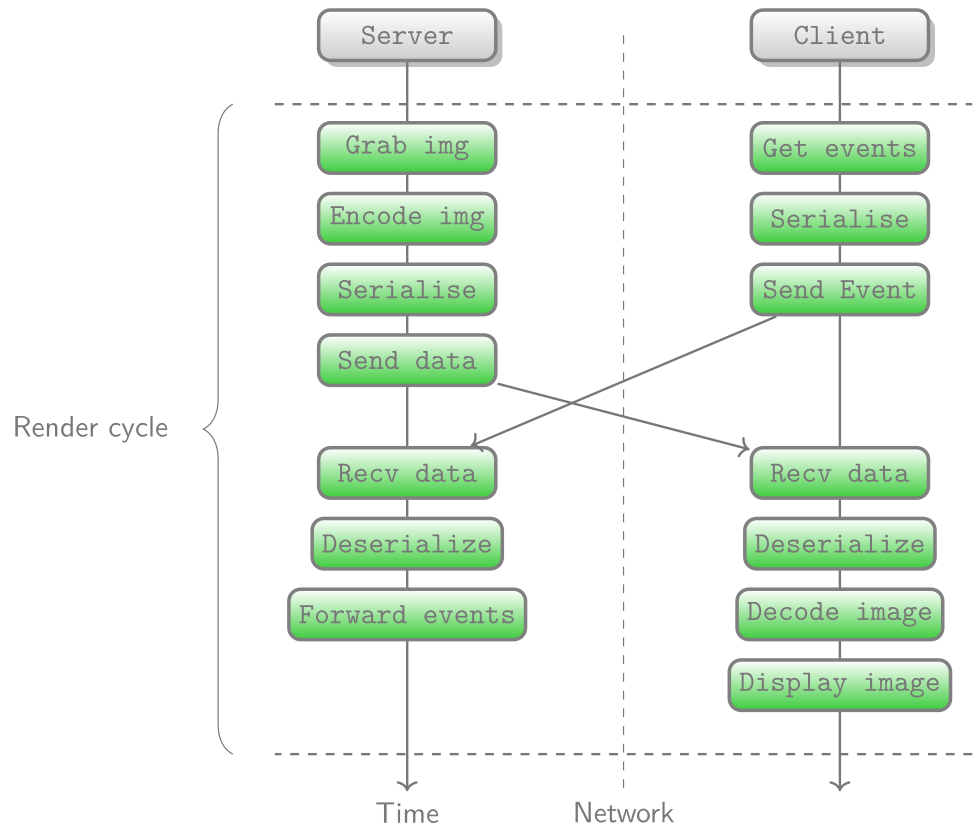

# Architecture

## Overview
The client/server main steps are represented here:

  
   
   
  <b>Steps during video stream</b>
   

The code is split in multiple parts:
- The main loop of the client/server, which is done respectively by `client.rs`/`server.rs`. This loop code tries to be OS independent. 
- For the server, the screen capture and the keyboard / mouse simulation, which depends on OS / system, is implemented in `server_x11.rs` (for the x11 version), `server_windows.rs` (for the Windows / GUI version).
- For the client, the keyboard / mouse capture and the image display also depends on the OS / system and is implemented in `client_x11.rs` (for the x11/xcb version), and in `client_wind3d.rs` (for the Windows / Direct3D version).
- The sound capture / playback and compression / decompression is implemented in `sound.rs`
- The video compression and decompression is done respectively in `video_encoder.rs` and `video_decoder.rs`. Those modules relies heavily on FFmpeg. 
- When needed, the `yuv_rgb_rs.rs` is used to provide conversions between yuv / rgb.
- A proxy which can handle client / server message is present in `proxy.rs`. It can live encode raw images / raw sound from a server and modify the server/client messages in consequence.
- The protocol used is described in a Protobuf format, in sanzu-common/proto/tunnel.proto3
- The protocol is accessible through `sanzu-common/src/proto.rs` with some helpers.

## Client / Server Communication
The server and the client currently support TLS and multiple authentication modes:
- TLS client authentication, which can be turned on or off, independently of the following options
- PAM which also supports password update
- Kerberos

## Client / Proxy / Server protocol
The data serialization / deserialization relies on Protobuf. As Protobuf doesn't embed it's packet size, an 8 byte header is added to describe its length. It's limited to 100Mo. Every data bytes is sent through the same socket (image, sound and inputs).

## Video encoding / decoding
The encoding / decoding process relies on FFmpeg library. Different encoders / decoders can be used. To accept a new encoder, one of the pixel format supported by the encoder / decoder must also be supported by Sanzu. As soon as at least one pixel format is supported, the encoder / decoder can be used. Sanzu actually supports yuv420p, yuv444p, rgb0 and nv12.

The video encoder / decoder can be tweaked using a configuration file. In most cases, low latency configuration are preferred to limit lag between client and server. The configuration is described in `config.rs`. FFmpeg codec options are based on key / value tuple strings.

## Audio
The audio capture / playback is done through the `cpal` library. From a capture point of view, the process fills in a circular buffer with the sound. This buffer is drained from the main loop and compressed, then sent to the client. Note that in case of network lag, the circular buffer is constantly updated with *fresh* sound. This way, when the network resumes, the content of the fresh sound is encoded and sent to the client.

## Keyboard
Sanzu captures raw keyboard inputs, without language layout interpretation, and apply them to the server. The result is that only the server side keyboard layout matters in the process.

